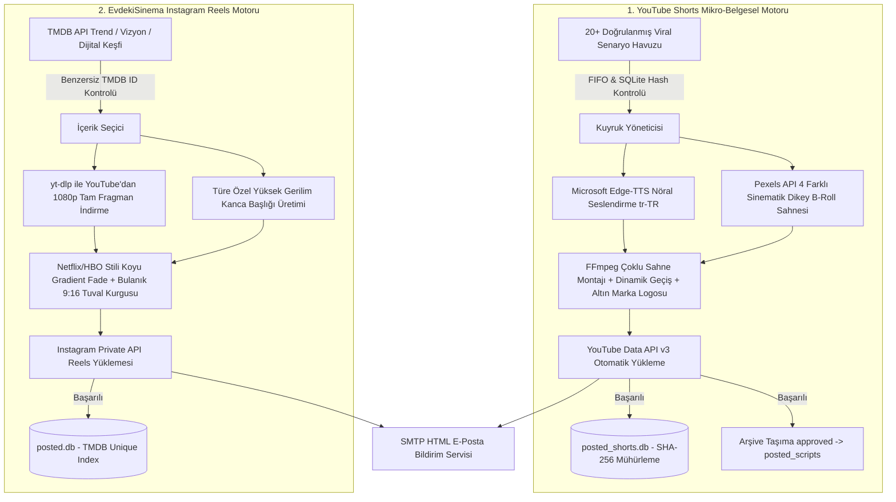

# 🚀 Auto Viral Media Engine (Otonom Sosyal Medya Fabrikası)

<p align="center">
  
  
  
  
  
  
</p>

---

## 📌 Proje Nedir? (Projenin Amacı ve Felsefesi)

**Auto Viral Media Engine**, hiçbir insan müdahalesine ihtiyaç duymadan 7/24 otonom olarak çalışan, **YouTube Shorts** ve **Instagram Reels** algoritmalarını domine etmek üzere tasarlanmış yeni nesil bir yapay zeka & medya üretim motorudur.

Geleneksel sosyal medya botları sadece önceden kaydedilmiş videoları yüklerken, bu sistem **içeriği sıfırdan keşfeder, metni kurgular, nöral ses üretir, konuya özel sinematik B-Roll sahnelerini indirir, profesyonel FFmpeg montajını tamamlar ve yükleyip veritabanına mühürler.**

---

## 🧠 İki Ayrı Bağımsız Üretim Hattı



---

## 🖥️ Hangi Sunucu / Donanım Gerekiyor?

Sistem tamamen optimize edilmiş, düşük CPU tüketimli ve bellek sızıntısı yapmayan asenkron mimariye sahiptir. Evinizdeki eski bir mini bilgisayarda veya en ucuz bulut sunucusunda (VPS) sorunsuz çalışır.

### 📊 Donanım Gereksinim Tablosu

| Bileşen | Minimum Gereksinim | Önerilen Sunucu | Açıklama |
| :--- | :--- | :--- | :--- |
| **İşlemci (CPU)** | 2 Çekirdek (x86_64 veya ARM64) | 4 Çekirdek (Intel/AMD/ARM) | FFmpeg video render ve blur filtreleri için |
| **Bellek (RAM)** | 2 GB RAM | 4 GB RAM | 1080x1920 video kurgusu sırasında ~1.2 GB RAM kullanılır |
| **Disk Alanı** | 15 GB SSD / NVMe | 40 GB NVMe SSD | Geçici video klipleri indirilir ve işlem bitince otomatik silinir |
| **İnternet Hızı** | 10 Mbps Download / Upload | 50+ Mbps | Fragman ve B-Roll indirme/yükleme hızı için |
| **İşletim Sistemi** | Ubuntu 22.04/24.04 LTS, Debian 11/12 | Ubuntu 24.04 LTS (Server) | Windows 10/11 Pro da tam desteklenir |

> [!TIP]
> **Önerilen Ucuz Sunucu Sağlayıcıları:** Hetzner Cloud (CX22 / CPX21), DigitalOcean ($6-12 Droplet), Contabo VPS, AWS EC2 (t3.medium), veya evde 7/24 açık duran **CasaOS / Raspberry Pi 4-5 (8GB)** mini PC.

---

## 🔑 Gerekli API Anahtarları ve Hazırlık

Projeyi çalıştırmadan önce aşağıdaki 5 servisin bilgilerini hazırlamanız gerekir (Hepsi ücretsizdir):

### 1. Pexels API Anahtarı (YouTube B-Roll İçin)
1. [Pexels API Portalına](https://www.pexels.com/api/) gidin ve ücretsiz üye olun.
2. *"Your API Key"* sekmesinden anahtarınızı kopyalayın.
3. `.env` dosyasındaki `PEXELS_API_KEY` alanına yapıştırın.

### 2. TMDB API Anahtarı (Film & Dizi Keşfi İçin)
1. [TheMovieDatabase (TMDB)](https://www.themoviedb.org/) hesabı açın.
2. **Ayarlar > API** sekmesinden ücretsiz *Developer API v3* anahtarı oluşturun.
3. `.env` dosyasındaki `TMDB_API_KEY` alanına yapıştırın.

### 3. Google Cloud YouTube Data API v3 (YouTube Shorts Yükleyici)
1. [Google Cloud Console](https://console.cloud.google.com/) üzerinde yeni bir proje oluşturun.
2. **APIs & Services > Library** bölümünden **YouTube Data API v3**'ü etkinleştirin.
3. **Credentials > Create Credentials > OAuth client ID** (Application Type: *Desktop App*) seçin.
4. İndirilen JSON dosyasını `client_secrets.json` adıyla `shorts_automation/` klasörüne koyun.
5. İlk çalıştırmada ekranda açılan Google onay linkinden kanala izin verin (`credentials.json` otomatik üretilir).

### 4. Instagram Hesabı (EvdekiSinema İçin)
1. Paylaşım yapılacak Instagram hesabının kullanıcı adı ve şifresini `.env` içine yazın.
2. Sistem ilk girişte `session.json` oluşturur ve sonraki paylaşımlarda şifre sormadan oturumu sürdürür.

### 5. SMTP E-Posta Bildirimi (Yandex / Gmail / Outlook)
* **Yandex Mail:** `smtp.yandex.com:587`, TLS: Açık, [Yandex Uygulama Şifresi](https://id.yandex.com/security/app-passwords) kullanın.
* **Gmail:** `smtp.gmail.com:587`, TLS: Açık, 2 Adımlı Doğrulama > [Google Uygulama Şifresi](https://myaccount.google.com/apppasswords) kullanın.

---

## 🛠️ Adım Adım Detaylı Kurulum Rehberi (Ubuntu / Debian Sunucu)

### 1. Sunucu Paketlerini Güncelleyin ve FFmpeg Kurun
```bash
sudo apt update && sudo apt upgrade -y
sudo apt install -y python3 python3-pip python3-venv ffmpeg fonts-dejavu fonts-freefont-ttf git curl
```

### 2. Depoyu Sunucuya Klonlayın
```bash
cd /opt
sudo git clone https://github.com/beratcemzengin/auto-viral-media-engine.git
sudo chown -R $USER:$USER /opt/auto-viral-media-engine
cd /opt/auto-viral-media-engine
```

### 3. Python Sanal Ortamını (Venv) Kurun
```bash
python3 -m venv venv
source venv/bin/activate
pip install --upgrade pip
pip install -r requirements.txt
```

### 4. Çevre Değişkenlerini (`.env`) Yapılandırın
```bash
cp .env.example .env
nano .env
```
*(Tüm API anahtarlarınızı, Instagram bilgilerinizi ve e-posta SMTP ayarlarınızı doldurup `Ctrl+O`, `Enter`, `Ctrl+X` ile kaydedin).*

### 5. Test Çalıştırması Yapın (Manuel Kontrol)

**YouTube Shorts Testi:**
```bash
/opt/auto-viral-media-engine/venv/bin/python3 -m shorts_automation.main
```

**Instagram Reels Testi:**
```bash
/opt/auto-viral-media-engine/venv/bin/python3 -m evdekisinema_reels.main
```

---

## ⏰ 7/24 Otonom Zamanlayıcı Kurulumu (Crontab)

Sunucunuzun başıboş, tam otomatik çalışması için cron zamanlayıcıyı açın:
```bash
crontab -e
```

Aşağıdaki satırları dosyanın en altına yapıştırın:

```bash
# ==============================================================================
# OTONOM SOSYAL MEDYA FABRİKASI GÖREV ZAMANLAYICISI (Türkiye Saati / UTC+3)
# ==============================================================================

# 🍿 EvdekiSinema Instagram Reels Paylaşımları (Her Gün 09:00 ve 17:00 TSİ)
0 6 * * * /opt/auto-viral-media-engine/venv/bin/python3 /opt/auto-viral-media-engine/evdekisinema_reels/main.py >> /opt/auto-viral-media-engine/evdekisinema_reels/logs/reels.log 2>&1
0 14 * * * /opt/auto-viral-media-engine/venv/bin/python3 /opt/auto-viral-media-engine/evdekisinema_reels/main.py >> /opt/auto-viral-media-engine/evdekisinema_reels/logs/reels.log 2>&1

# 🧠 YouTube Shorts Viral Mikro-Belgesel Yayınları (Günde 4 Video: 07:30, 11:00, 17:30, 20:00 TSİ)
30 4 * * * /opt/auto-viral-media-engine/venv/bin/python3 /opt/auto-viral-media-engine/shorts_automation/main.py >> /opt/auto-viral-media-engine/shorts_automation/logs/shorts.log 2>&1
0 8 * * * /opt/auto-viral-media-engine/venv/bin/python3 /opt/auto-viral-media-engine/shorts_automation/main.py >> /opt/auto-viral-media-engine/shorts_automation/logs/shorts.log 2>&1
30 14 * * * /opt/auto-viral-media-engine/venv/bin/python3 /opt/auto-viral-media-engine/shorts_automation/main.py >> /opt/auto-viral-media-engine/shorts_automation/logs/shorts.log 2>&1
0 17 * * * /opt/auto-viral-media-engine/venv/bin/python3 /opt/auto-viral-media-engine/shorts_automation/main.py >> /opt/auto-viral-media-engine/shorts_automation/logs/shorts.log 2>&1

# 💾 Haftalık Tam Sistem & Canlı Veritabanı ZIP Yedeği (Her Pazar Gece 03:00 TSİ E-Posta İle)
0 0 * * 0 /opt/auto-viral-media-engine/venv/bin/python3 /opt/auto-viral-media-engine/shorts_automation/server_backup_mailer.py >> /opt/auto-viral-media-engine/shorts_automation/logs/backup.log 2>&1
```

---

## 🛡️ Sık Sorulan Sorular ve Hata Çözümleri (FAQ)

<details>
<summary><b>1. YouTube API "Quota Exceeded" Hatası Veriyor, Ne Yapmalıyım?</b></summary>
Google Cloud, YouTube Data API v3 için günlük ücretsiz 10.000 kota birimi verir. Bir video yükleme işlemi 1.600 birim harcar. Yani günde ücretsiz olarak en fazla 6 video yükleyebilirsiniz. Günde 4 Shorts paylaşımı kota sınırlarının tamamen içindedir.
</details>

<details>
<summary><b>2. FFmpeg Video İşlerken Donuyor veya Çok Yavaş Kalıyor?</b></summary>
Video işleme modülü (`video_processor.py`), arka plan bulanıklaştırma (boxblur) filtresini 1080p yerine önce 270x480 çözünürlüğe düşürüp blur uyguladıktan sonra 1080p'ye büyütür. Bu sayede CPU yükü %90 oranında azalır ve 1-2 çekirdekli sunucularda bile render 30-45 saniyede tamamlanır.
</details>

<details>
<summary><b>3. Aynı Video İki Kez Paylaşılabilir mi?</b></summary>
Hayır. Hem YouTube hem Instagram motorlarında çift katmanlı SQLite veritabanı mühürlemesi (SHA-256 metin hash'i ve benzersiz TMDB ID) ile atomic dosya taşıma sistemi aktiftir. Daha önce paylaşılan hiçbir içerik tekrar işlenmez.
</details>

---

## 📜 Lisans & Geliştirici

Bu proje **MIT Lisansı** altında korunmaktadır. Ticari ve kişisel projelerinizde dilediğiniz gibi kullanabilir, özelleştirebilirsiniz.

* **Geliştirici:** [Berat Cem Zengin](https://github.com/beratcemzengin)
* **Destek & İletişim:** `beratcemzengin@gmail.com`

⭐ Projeyi beğendiyseniz GitHub üzerinden bir **Star** bırakmayı unutmayın! 🚀🍿
