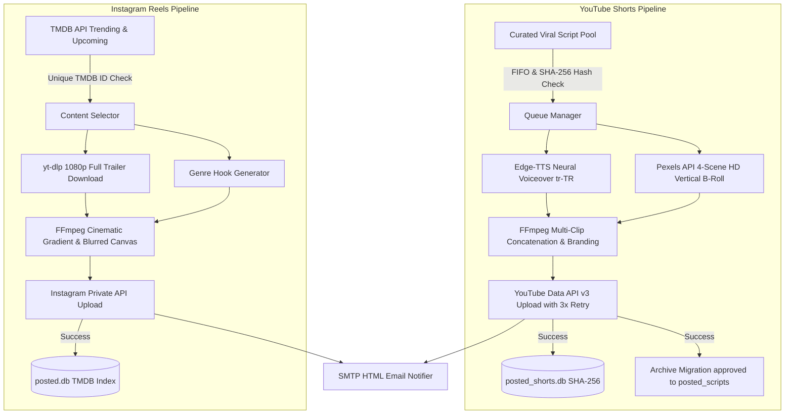

# 🚀 Auto Viral Media Engine (Autonomous Social Media Pipeline)

<p align="center">
  
  
  
  
  
  
</p>

An enterprise-grade, 24/7 autonomous AI content generation and publishing engine designed to create, render, and publish high-retention **YouTube Shorts** (micro-documentaries) and **Instagram Reels** (cinematic full trailers) with persistent anti-duplicate memory and real-time email alerting.

---

## ⚡ 1-Click Interactive Installation (Ubuntu 22.04 / 24.04 LTS & Debian)

Run the following command on a fresh Ubuntu or Debian server. The interactive setup wizard will automatically install system packages (`FFmpeg`, `Python3`, `Venv`, `Fonts`), guide you through your API credentials, generate your `.env` configuration, initialize SQLite databases, and configure your 24/7 crontab schedule:

```bash
curl -sSL https://raw.githubusercontent.com/beratcemzengin/auto-viral-media-engine/main/install.sh | bash
```

*(Or via `wget`: `wget -qO- https://raw.githubusercontent.com/beratcemzengin/auto-viral-media-engine/main/install.sh | bash`)*

---

## 🔑 Prerequisites & Detailed API Setup Guide

Follow the step-by-step instructions below to obtain the required API credentials **(all services have free tiers):**

---

### 1. 🎥 Pexels API Key — Free HD Vertical B-Roll

*Used by the YouTube Shorts engine to fetch 4-scene contextual vertical HD video clips.*

1. Go to [pexels.com/api](https://www.pexels.com/api/) and click **"Get Started"** to create a free account.
2. After logging in, click **"Your API Key"** from the top navigation menu.
3. Fill in the short API request form:
   - **App Name:** `Auto Viral Media Engine`
   - **Description:** `Automated micro-documentary B-roll curation and video generation`
4. Copy the generated API Key (a 56-character string).
5. Add to your `.env` file:
   ```ini
   PEXELS_API_KEY=your_pexels_api_key_here
   ```

---

### 2. 🎬 TMDB API Key — Free Movie & TV Series Discovery

*Used by the Instagram Reels engine to discover trending movies, upcoming releases, and digital platform series.*

1. Create a free account at [themoviedb.org/signup](https://www.themoviedb.org/signup).
2. Verify your email address and log in.
3. Navigate to **Account Settings > API** ([themoviedb.org/settings/api](https://www.themoviedb.org/settings/api)).
4. Click **"Create"** under "Request an API Key" and select **"Developer"**.
5. Accept the API terms and fill in the application form:
   - **Application Name:** `Auto Viral Media Engine`
   - **Application URL:** `https://github.com/beratcemzengin/auto-viral-media-engine`
   - **Summary:** `Automated movie and TV trailer curation for Instagram Reels.`
6. Copy the **API Key (v3 auth)** string.
7. Add to your `.env` file:
   ```ini
   TMDB_API_KEY=your_tmdb_v3_api_key_here
   ```

---

### 3. 🔴 Google Cloud — YouTube Data API v3 (OAuth 2.0)

*Required to automatically publish rendered Shorts to your YouTube channel. Follow every sub-step carefully.*

#### Step 1 — Create Google Cloud Project
1. Go to [console.cloud.google.com](https://console.cloud.google.com/).
2. Click the project dropdown at the top → **"NEW PROJECT"**.
3. Name it (e.g., `YouTube-Shorts-Automation`) and click **"CREATE"**.

#### Step 2 — Enable YouTube Data API v3
1. In the left menu go to **APIs & Services > Library**.
2. Search for **"YouTube Data API v3"**, click it, then click **"ENABLE"**.

#### Step 3 — Configure OAuth Consent Screen (Branding)
1. Go to **APIs & Services > OAuth consent screen** (new UI: **Google Auth Platform > Branding**).
2. Select **User Type: External** and click **"CREATE"**.
3. Fill in the required fields:
   - **App name:** `Shorts Uploader`
   - **User support email:** your Gmail address
   - **Homepage URL:** `https://github.com/beratcemzengin/auto-viral-media-engine`
   - **Privacy Policy URL:** `https://github.com/beratcemzengin/auto-viral-media-engine/blob/main/PRIVACY.md`
   - **Developer contact email:** your Gmail address
4. Click **"SAVE AND CONTINUE"** through all steps.

#### Step 4 — Add Test User
1. In the **Audience** section (or **Test users** under consent screen), click **"+ ADD USERS"**.
2. Enter the Gmail address associated with your YouTube channel.
3. Click **"SAVE"**.

#### Step 5 — Publish App to Production ⚠️ CRITICAL
> This is the most important step. Skipping it causes the OAuth refresh token to expire every 7 days, breaking the automation.

1. In **Google Auth Platform > Audience**, find the **"Publishing status"** section.
2. Click **"Publish app"**.
3. Confirm the dialog.
4. Status should now show **"In production"** ✅

**Without this step, your token will expire every 7 days and uploads will fail with `invalid_grant` error.**

#### Step 6 — Create OAuth Credentials
1. Go to **APIs & Services > Credentials**.
2. Click **"+ CREATE CREDENTIALS > OAuth client ID"**.
3. Select **Application type: Desktop app**.
4. Name it `Shorts-Desktop-Client` and click **"CREATE"**.
5. Click **"Download JSON"** on the created credential.
6. Rename the downloaded file to **`client_secrets.json`**.
7. Place it in the `shorts_automation/` directory on your server.

#### Step 7 — First-Time Authorization (Generate credentials.json)

Run this once on your **local machine** (Windows/Mac/Linux with a browser), not on the server:

```bash
cd shorts_automation
python reauth_oob.py
```

The script will print a Google URL. Open it in your browser, sign in with your YouTube channel's Google account, click **"Allow"**, and paste the displayed code back into the terminal.

This generates `credentials.json` which must then be copied to the server:

```bash
# Copy credentials.json to server
scp credentials.json user@your-server-ip:/opt/auto-viral-media-engine/shorts_automation/credentials.json
```

> **Note:** Since the app is in Production mode, this `credentials.json` will work indefinitely without re-authorization.

---

### 4. 📸 Instagram Credentials & Session Setup

*The Instagram Reels engine uses `instagrapi` to upload 9:16 vertical Reels directly to your Instagram account.*

1. Add your Instagram credentials to `.env`:
   ```ini
   INSTAGRAM_USERNAME=your_instagram_username
   INSTAGRAM_PASSWORD=your_instagram_password
   ```
2. On the first successful run, the engine saves an authenticated device session to `instagram_reels/session.json`.
3. All subsequent runs load this session file, bypassing login checkpoints and 2FA challenges automatically.

---

### 5. 📧 SMTP Email — Instant Alerts & Weekly Backup Delivery

*Receive real-time HTML email notifications when a video is published or when an error occurs, plus automated weekly ZIP backups.*

#### Option A: Yandex Mail (Recommended — more permissive SMTP)
1. Go to [Yandex ID Security > App Passwords](https://id.yandex.com/security/app-passwords).
2. Click **"Add app password" > "Mail"**.
3. Copy the generated 16-character password.
4. Add to `.env`:
   ```ini
   ALERT_EMAIL_RECIPIENT=your_notification_email@gmail.com
   SMTP_SERVER=smtp.yandex.com
   SMTP_PORT=587
   SMTP_USER=your_yandex_email@yandex.com
   SMTP_PASSWORD=your_yandex_app_password
   SMTP_USE_TLS=true
   ```

#### Option B: Gmail
1. Enable **2-Step Verification** on your Google Account.
2. Go to [Google App Passwords](https://myaccount.google.com/apppasswords).
3. Click **"Create app password"**, name it `Auto Media Mailer`, and copy the 16-character code.
4. Add to `.env`:
   ```ini
   ALERT_EMAIL_RECIPIENT=your_notification_email@gmail.com
   SMTP_SERVER=smtp.gmail.com
   SMTP_PORT=587
   SMTP_USER=your_email@gmail.com
   SMTP_PASSWORD=your_16_char_gmail_app_password
   SMTP_USE_TLS=true
   ```

---

## 🌟 Key Architecture & Capabilities

### 1. 🧠 YouTube Shorts Viral Engine (`shorts_automation`)
- **Cognitive-Gap Script Engine:** Pool of 20+ verified viral micro-documentary scripts (Business Wars, Sports Legends, Science Mysteries, Historical Curiosities).
- **Dynamic 4-Scene B-Roll:** Pexels API queries 4 contextual HD vertical clips, cuts every 4–6 seconds to maximize retention.
- **Neural Edge TTS & Kinetic Subtitles:** Human-like Turkish voiceover (`tr-TR-AhmetNeural`) with 2-line animated synced captions.
- **Audio & Branding:** Background music ducking, gold brand logo overlay, seamless loop hook.
- **Bulletproof Upload Engine:** 3× retry with exponential backoff (60s → 120s → 240s) for transient YouTube API errors (500/502/503).
- **Anti-Duplicate Shield:** SHA-256 text hash in SQLite + atomic FIFO file migration (`approved_scripts/` → `posted_scripts/`).

### 2. 🍿 Instagram Reels Cinematic Engine (`instagram_reels`)
- **Automated Discovery:** Fetches trending movies, upcoming releases, and digital series via TMDB API.
- **Full Trailer Processing (up to 90s):** Skips silent studio intros, preserves full action/dialogue trailer.
- **Netflix/HBO Style Aesthetic:** Vertical dark gradient fade, CPU-optimized blurred canvas (downscale-blur-upscale, 90% faster render), floating badge overlays (IMDb, Genre, Platform, CTA).
- **Persistent Deduplication:** SQLite `posted.db` with unique TMDB ID index — no content is ever reposted.

### 3. 🔁 Fault-Tolerant Retry System (`run_shorts_with_retry.sh`)
Each scheduled cron job runs the pipeline up to **3 times** before giving up:
- **Attempt 1:** Immediate run.
- **Attempt 2:** If failed, wait **10 minutes** and retry.
- **Attempt 3:** If still failed, wait **20 more minutes** and retry one last time.
- On all 3 failures: error email is sent automatically.

### 4. 📧 Enterprise Notifications & Weekly Backup
- Real-time HTML email on every success/failure with direct post links.
- Automated weekly ZIP backup of all databases and configs, emailed as an attachment.

---

## 🏗️ System Flowchart



---

## 🖥️ Hardware & Server Requirements

| Component | Minimum | Recommended | Note |
| :--- | :--- | :--- | :--- |
| **CPU** | 2 Cores (x86_64 / ARM64) | 4 Cores | FFmpeg encoding & blur filter |
| **RAM** | 2 GB | 4 GB | ~1.2 GB used during 1080p render |
| **Storage** | 15 GB SSD | 40 GB NVMe | Temp files auto-deleted after each post |
| **Network** | 10 Mbps | 50+ Mbps | For clip download & upload speed |
| **OS** | Ubuntu 22.04 / 24.04, Debian 11/12 | Ubuntu 24.04 LTS | Windows 10/11 also supported |

> **Recommended Cloud VPS:** Hetzner Cloud CX22 (~4€/mo), DigitalOcean Basic Droplet (~$12/mo), Contabo VPS S (~5.5€/mo), or a home mini PC / Raspberry Pi 4-5 (8GB).

---

## 🛠️ Manual Installation (Ubuntu / Debian)

```bash
# 1. Install system dependencies
sudo apt update && sudo apt install -y python3 python3-pip python3-venv ffmpeg fonts-dejavu git curl

# 2. Clone repository
cd /opt
sudo git clone https://github.com/beratcemzengin/auto-viral-media-engine.git
sudo chown -R $USER:$USER /opt/auto-viral-media-engine
cd /opt/auto-viral-media-engine

# 3. Create Python virtual environment
python3 -m venv venv
source venv/bin/activate
pip install --upgrade pip
pip install -r requirements.txt

# 4. Configure environment variables
cp .env.example .env
nano .env

# 5. Copy your client_secrets.json and credentials.json
cp /path/to/client_secrets.json shorts_automation/client_secrets.json
cp /path/to/credentials.json shorts_automation/credentials.json

# 6. Run manual test
export ALLOW_YOUTUBE_UPLOAD=1
python3 -m shorts_automation.main
python3 -m instagram_reels.main
```

---

## ⏰ Automated Crontab Schedule

The 1-click installer configures this automatically. To set it up manually, run `crontab -e`:

```bash
# ==============================================================================
# AUTO VIRAL MEDIA ENGINE — CRONTAB SCHEDULE (UTC+3 / Turkey Time)
# ==============================================================================

# 🍿 Instagram Reels — Daily at 09:00 & 17:00 TR (06:00 & 14:00 UTC)
0 6 * * * /opt/auto-viral-media-engine/venv/bin/python3 /opt/auto-viral-media-engine/instagram_reels/main.py >> /opt/auto-viral-media-engine/instagram_reels/logs/reels.log 2>&1
0 14 * * * /opt/auto-viral-media-engine/venv/bin/python3 /opt/auto-viral-media-engine/instagram_reels/main.py >> /opt/auto-viral-media-engine/instagram_reels/logs/reels.log 2>&1

# 🧠 YouTube Shorts — 4x Daily: 07:30, 11:00, 17:30, 20:00 TR Time (with 3-attempt retry)
30 4 * * * /opt/auto-viral-media-engine/shorts_automation/run_shorts_with_retry.sh
0 8 * * * /opt/auto-viral-media-engine/shorts_automation/run_shorts_with_retry.sh
30 14 * * * /opt/auto-viral-media-engine/shorts_automation/run_shorts_with_retry.sh
0 17 * * * /opt/auto-viral-media-engine/shorts_automation/run_shorts_with_retry.sh

# 💾 Weekly System & Database Backup — Every Sunday at 03:00 TR (00:00 UTC)
0 0 * * 0 /opt/auto-viral-media-engine/venv/bin/python3 /opt/auto-viral-media-engine/shorts_automation/server_backup_mailer.py >> /opt/auto-viral-media-engine/shorts_automation/logs/backup.log 2>&1
```

> **Note:** All cron times are in UTC. Turkey is UTC+3, so 07:30 TR = 04:30 UTC.

---

## 🔧 Troubleshooting

<details>
<summary><b>❌ YouTube upload fails with <code>invalid_grant: Token has been expired or revoked</code></b></summary>

**Cause:** The OAuth refresh token has been revoked or expired.

**Most Common Reason:** Your Google Cloud app was in **"Testing"** mode. Test mode tokens expire every 7 days.

**Fix:**
1. In Google Cloud Console → **Google Auth Platform > Audience** → set Publishing status to **"In production"**.
2. Re-run the OOB authorization flow on your local machine:
   ```bash
   cd shorts_automation
   python reauth_oob.py
   ```
3. Open the printed URL in your browser, authorize, paste the code back.
4. Copy the new `credentials.json` to your server.
</details>

<details>
<summary><b>❌ YouTube upload fails with <code>webbrowser.Error: could not locate runnable browser</code></b></summary>

**Cause:** Old versions of the uploader called `flow.run_local_server()` which tries to open a browser. Headless Linux servers have no browser.

**Fix:** The current `youtube_uploader.py` in this repository handles this correctly — it never tries to open a browser. If you see this error, pull the latest version:
```bash
cd /opt/auto-viral-media-engine && git pull origin main
```
Then re-authorize using `reauth_oob.py` on your local machine.
</details>

<details>
<summary><b>❌ YouTube upload fails with <code>HttpError 500 Internal error encountered</code></b></summary>

**Cause:** Transient YouTube API server error. These are temporary and outside your control.

**Fix:** Already handled automatically. The `youtube_uploader.py` retries up to **3 times** with exponential backoff (60s → 120s → 240s). Additionally, `run_shorts_with_retry.sh` retries the entire pipeline at 10 and 20 minutes if the first attempt fails.
</details>

<details>
<summary><b>❌ How do YouTube API quotas work?</b></summary>

Google Cloud provides **10,000 free quota units per day** for YouTube Data API v3. A standard video upload costs **1,600 units**.

- Maximum free uploads per day: **6 videos**
- This project schedules **4 Shorts per day** — well within the free limit.

If you exceed the quota, uploads will fail with `quotaExceeded` error and resume automatically the next day.
</details>

<details>
<summary><b>❌ FFmpeg rendering is very slow or hangs</b></summary>

**Cause:** Applying boxblur filter at full 1080x1920 resolution is extremely CPU-intensive.

**Fix:** Already optimized. The engine uses a **Downscale-Blur-Upscale** pipeline:
- Downscale background to 270x480 → Apply boxblur → Upscale to 1080x1920
- This reduces render time from **3+ minutes to ~30 seconds** on 2-core VPS nodes.

If still slow, make sure no other heavy process is running on your server during render time.
</details>

<details>
<summary><b>❌ Instagram raises a checkpoint or login challenge</b></summary>

**Cause:** Instagram detected a new device or suspicious login.

**Fix:**
1. Log into Instagram manually on a phone or browser and approve the login.
2. Delete `instagram_reels/session.json` on the server.
3. Run `python3 instagram_reels/main.py` once manually to create a fresh session.
</details>

<details>
<summary><b>❌ Duplicate video posted twice</b></summary>

**Cause:** Should not happen with the current system. If it does, the SQLite database may have been corrupted or reset.

**Fix:** Check the database:
```bash
cd /opt/auto-viral-media-engine
sqlite3 shorts_automation/data/posted_shorts.db "SELECT title, posted_at FROM posted_shorts ORDER BY posted_at DESC LIMIT 10;"
```
The SHA-256 hash unique index prevents any content from being inserted twice.
</details>

---

## 📄 License & Author

Distributed under the **MIT License**. See [`LICENSE`](LICENSE) for more information.

- **Author:** [Berat Cem Zengin](https://github.com/beratcemzengin)
- **Contact:** `beratcemzengin@gmail.com`
- **Privacy Policy:** [PRIVACY.md](PRIVACY.md)

⭐ If you find this project useful, please consider giving it a **Star** on GitHub! 🚀🍿
