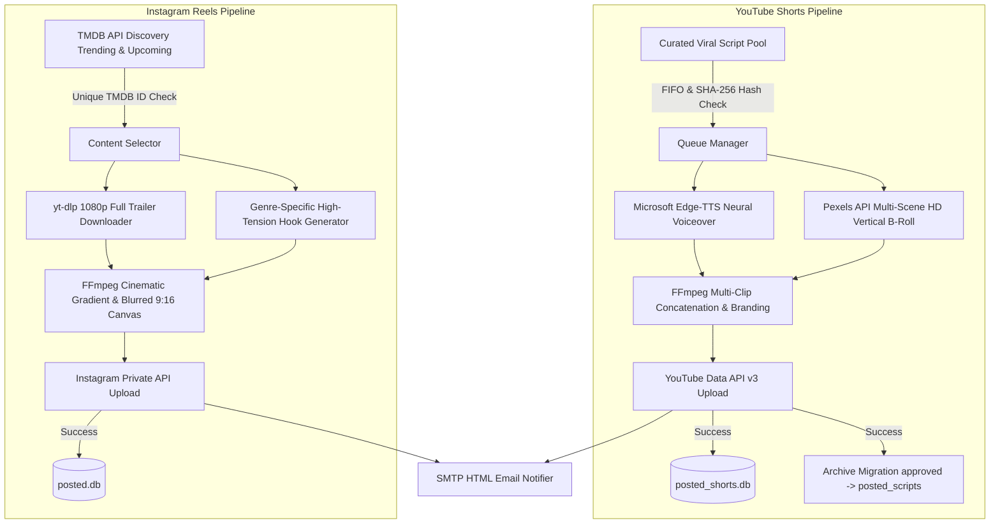

# 🚀 Auto Viral Media Engine (Autonomous Social Media Pipeline)

<p align="center">
  
  
  
  
  
  
</p>

An enterprise-grade, 24/7 autonomous AI content generation and publishing engine designed to create, render, and publish high-retention **YouTube Shorts** (micro-documentaries) and **Instagram Reels** (cinematic full trailers) with persistent anti-duplicate memory and real-time email alerting.

---

## ⚡ 1-Click Interactive Installation (Ubuntu 22.04 / 24.04 LTS & Debian)

Run the following command on a fresh Ubuntu or Debian server. The interactive setup wizard will automatically install system packages (`FFmpeg`, `Python3`, `Venv`, `Fonts`), guide you through your API credentials, generate your `.env` configuration, initialize SQLite databases, and configure your 24/7 crontab schedule:

```bash
curl -sSL https://raw.githubusercontent.com/beratcemzengin/auto-viral-media-engine/main/install.sh | bash
```

*(Or via `wget`: `wget -qO- https://raw.githubusercontent.com/beratcemzengin/auto-viral-media-engine/main/install.sh | bash`)*

---

## 🌟 Key Architecture & Capabilities

### 1. 🧠 YouTube Shorts Viral Engine (`shorts_automation`)
* **Cognitive-Gap Script Engine:** Curated pool of 20+ verified, fact-checked viral micro-documentary scripts (Business Wars, Sports Legends, Science Mysteries, Historical Curiosities).
* **Dynamic Multi-Scene B-Roll (4-Scene Transition):** Automatically queries Pexels API to download contextual HD vertical clips and cuts every 4–6 seconds to maximize audience retention.
* **Neural Edge TTS & 2-Line Kinetic Subtitles:** Generates human-like voiceovers (`edge-tts`) with synchronized animated captions.
* **Smart Audio & Logo Mixing:** Background music ducking, gold brand tag overlays, and seamless loop ending hooks.
* **Dual-Layer Anti-Duplicate Engine:** SHA-256 text hashing stored in SQLite (`posted_shorts.db`) and automatic FIFO file migration (`approved_scripts/` ➔ `posted_scripts/`). Zero duplicate uploads guaranteed.

### 2. 🍿 Instagram Reels Cinematic Engine (`instagram_reels`)
* **Automated Discovery:** Fetches trending movies, upcoming releases, and digital platform series via the TMDB API.
* **Full Trailer Processing (Up to 90s):** Eliminates silent studio intros and preserves the entire action/dialogue trailer.
* **Netflix & HBO Style Aesthetic:** Vertical dark gradient fade, blurred darkened background canvas (CPU-optimized downscale-blur-upscale pipeline), and floating badge boxes (IMDb Score, Genre, Platform, DM Share CTA).
* **Persistent Deduplication:** SQLite database (`posted.db`) with unique TMDB ID indexing prevents repeated posts.

### 3. 📧 Enterprise Notifications & Backup Mailer
* **Real-time HTML Email Alerts:** Immediate success/failure emails with direct post links and error tracebacks sent via SMTP.
* **Weekly Automated System Backup:** Automatically zips all scripts, databases, and configuration files and emails them as an attachment every week.

---

## 🏗️ System Flowchart



---

## 🖥️ Hardware & Server Requirements

The engine features an asynchronous, low-CPU rendering pipeline optimized for lightweight virtual private servers (VPS) and home servers.

| Component | Minimum Specification | Recommended Specification | Note |
| :--- | :--- | :--- | :--- |
| **Processor (CPU)** | 2 Cores (x86_64 or ARM64) | 4 Cores (Intel / AMD / ARM) | For FFmpeg encoding & blur rendering |
| **Memory (RAM)** | 2 GB RAM | 4 GB RAM | Uses ~1.2 GB during 1080p rendering |
| **Storage (Disk)** | 15 GB SSD / NVMe | 40 GB NVMe SSD | Temporary video files are cleaned automatically |
| **Network** | 10 Mbps Download / Upload | 50+ Mbps | For fast video download & upload |
| **Operating System** | Ubuntu 22.04 / 24.04 LTS, Debian 11/12 | Ubuntu 24.04 LTS (Server) | Windows 10/11 Pro also supported |

> [!TIP]
> **Recommended Cloud VPS Providers:** Hetzner Cloud (CX22 / CPX21), DigitalOcean ($6–12 Droplet), Contabo VPS, AWS EC2 (t3.medium), or a local **CasaOS / Raspberry Pi 4-5 (8GB)** mini PC.

---

## 🔑 Prerequisites & API Keys

Before starting, obtain the following credentials (all have free tiers):

1. **Pexels API Key:** [pexels.com/api](https://www.pexels.com/api/) (Free HD vertical B-Roll video downloads).
2. **TMDB API Key:** [themoviedb.org/settings/api](https://www.themoviedb.org/settings/api) (Free movie and TV series discovery).
3. **YouTube Data API v3:** Google Cloud Console OAuth 2.0 Desktop Application `client_secrets.json`.
4. **Instagram Credentials:** Account username & password (session cookies are cached in `session.json`).
5. **SMTP Mail Credentials:** Yandex, Gmail, or custom SMTP server for instant delivery alerts.

---

## 🛠️ Manual Installation (Ubuntu / Debian)

If you prefer to configure the system manually instead of using the 1-click installer:

```bash
# 1. Update system & install dependencies
sudo apt update && sudo apt install -y python3 python3-pip python3-venv ffmpeg fonts-dejavu git curl

# 2. Clone repository
cd /opt
sudo git clone https://github.com/beratcemzengin/auto-viral-media-engine.git
sudo chown -R $USER:$USER /opt/auto-viral-media-engine
cd /opt/auto-viral-media-engine

# 3. Create virtual environment
python3 -m venv venv
source venv/bin/activate
pip install --upgrade pip
pip install -r requirements.txt

# 4. Configure environment
cp .env.example .env
nano .env

# 5. Run manual test
python3 -m shorts_automation.main
python3 -m instagram_reels.main
```

---

## ⏰ Automated Crontab Schedule

Add the following schedule to `crontab -e`:

```bash
# ==============================================================================
# AUTO VIRAL MEDIA ENGINE CRONTAB SCHEDULE (UTC+3 / TR Time)
# ==============================================================================

# 🍿 Instagram Reels (Daily at 09:00 & 17:00 TR Time / 06:00 & 14:00 UTC)
0 6 * * * /opt/auto-viral-media-engine/venv/bin/python3 /opt/auto-viral-media-engine/instagram_reels/main.py >> /opt/auto-viral-media-engine/instagram_reels/logs/reels.log 2>&1
0 14 * * * /opt/auto-viral-media-engine/venv/bin/python3 /opt/auto-viral-media-engine/instagram_reels/main.py >> /opt/auto-viral-media-engine/instagram_reels/logs/reels.log 2>&1

# 🧠 YouTube Shorts (4 Times Daily: 07:30, 11:00, 17:30, 20:00 TR Time)
30 4 * * * /opt/auto-viral-media-engine/venv/bin/python3 /opt/auto-viral-media-engine/shorts_automation/main.py >> /opt/auto-viral-media-engine/shorts_automation/logs/shorts.log 2>&1
0 8 * * * /opt/auto-viral-media-engine/venv/bin/python3 /opt/auto-viral-media-engine/shorts_automation/main.py >> /opt/auto-viral-media-engine/shorts_automation/logs/shorts.log 2>&1
30 14 * * * /opt/auto-viral-media-engine/venv/bin/python3 /opt/auto-viral-media-engine/shorts_automation/main.py >> /opt/auto-viral-media-engine/shorts_automation/logs/shorts.log 2>&1
0 17 * * * /opt/auto-viral-media-engine/venv/bin/python3 /opt/auto-viral-media-engine/shorts_automation/main.py >> /opt/auto-viral-media-engine/shorts_automation/logs/shorts.log 2>&1

# 💾 Weekly System & Database Backup Email (Every Sunday at 03:00 TR Time)
0 0 * * 0 /opt/auto-viral-media-engine/venv/bin/python3 /opt/auto-viral-media-engine/shorts_automation/server_backup_mailer.py >> /opt/auto-viral-media-engine/shorts_automation/logs/backup.log 2>&1
```

---

## 🛡️ Frequently Asked Questions (FAQ)

<details>
<summary><b>1. How do YouTube API quotas work?</b></summary>
Google Cloud provides 10,000 free quota units per day for YouTube Data API v3. A standard video upload costs 1,600 units. Thus, you can upload up to 6 videos per day completely free of charge. Scheduling 4 Shorts per day is well within the free limits.
</details>

<details>
<summary><b>2. How is rendering speed optimized on low-spec CPUs?</b></summary>
The video processing pipeline scales the background video down to 270x480 before applying the boxblur filter, then scales it back up to 1080x1920. This reduces blur computation by ~90%, enabling full 90s 1080p renders in under 30 seconds on 2-core VPS nodes.
</details>

<details>
<summary><b>3. Is duplicate posting prevented?</b></summary>
Yes. Both pipelines use SQLite database indexing (SHA-256 script hashing and unique TMDB IDs) along with atomic file migration (`approved_scripts/` to `posted_scripts/`). No content is ever processed or published twice.
</details>

---

## 📄 License & Author

Distributed under the **MIT License**. See `LICENSE` for more information.

* **Author:** [Berat Cem Zengin](https://github.com/beratcemzengin)
* **Contact:** `beratcemzengin@gmail.com`

⭐ If you find this project useful, please consider giving it a **Star** on GitHub! 🚀🍿
