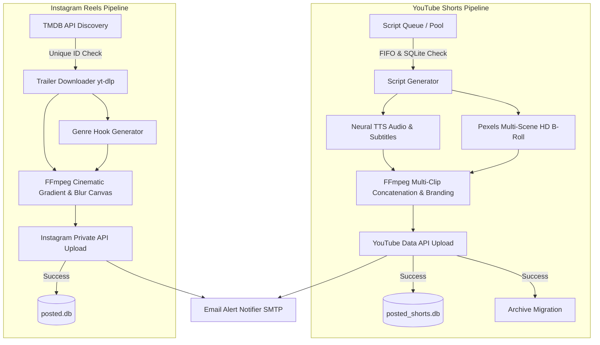

# 🚀 Auto Viral Media Engine

<p align="center">
  
  
  
  
  
  
</p>

An autonomous, 24/7 AI-powered content generation and publishing engine designed to create, render, and distribute high-retention **YouTube Shorts** (micro-documentaries) and **Instagram Reels** (cinematic full trailers) with persistent anti-duplicate memory and instant email alerting.

---

## 🌟 Key Features

### 1. 🧠 YouTube Shorts Viral Engine (`shorts_automation`)
* **Cognitive-Gap Script Architecture:** 20+ fact-checked, high-tension viral micro-documentary scripts (Business Wars, Sports Legends, Science Mysteries, Historical Curiosities).
* **Dynamic Multi-Scene B-Roll (4-Scene Transition):** Automatically queries Pexels API to download contextual HD vertical clips and cuts every 4–6 seconds to maximize audience retention.
* **Neural Edge TTS & 2-Line Subtitles:** Generates human-like voiceover (`edge-tts`) and synchronized kinetic typography.
* **Smart Audio & Logo Mixing:** Background music ducking, gold brand tag overlays, and seamless loop ending hooks.
* **Dual-Layer Anti-Duplicate Engine:** SHA-256 text hashing stored in SQLite (`posted_shorts.db`) and automatic FIFO file migration (`approved_scripts/` ➔ `posted_scripts/`). Zero duplicate uploads.

### 2. 🍿 Instagram Reels Cinematic Engine (`evdekisinema_reels`)
* **Automated Discovery:** Fetches trending movies, upcoming releases, and digital platform series via the TMDB API.
* **Full Trailer Processing (Up to 90s):** Eliminates silent studio intros and preserves the entire action/dialogue trailer.
* **Netflix & HBO Style Aesthetic:** Vertical dark gradient fade, blurred darkened background canvas (CPU-optimized downscale-blur-upscale pipeline), and floating badge boxes (IMDb Score, Genre, Platform, DM Share CTA).
* **Persistent Deduplication:** SQLite database (`posted.db`) with unique TMDB ID indexing prevents repeated posts.

### 3. 📧 Enterprise Notifications & Backup Mailer
* **Real-time HTML Email Alerts:** Immediate success/failure emails with direct post links and error tracebacks sent via SMTP.
* **Weekly Automated System Backup:** Automatically zips all scripts, databases, and configuration files and emails them as an attachment every week.

---

## 🏗️ System Architecture



---

## 🚀 Quick Start & Installation

### 1. Clone the Repository
```bash
git clone https://github.com/beratcemzengin/auto-viral-media-engine.git
cd auto-viral-media-engine
```

### 2. Set Up Virtual Environment
```bash
# Linux / macOS
python3 -m venv venv
source venv/bin/activate

# Windows
python -m venv venv
.\venv\Scripts\activate
```

### 3. Install Dependencies
```bash
pip install -r requirements.txt
```

### 4. Configure Environment Variables
Copy `.env.example` to `.env` and fill in your API credentials:
```bash
cp .env.example .env
```

```ini
# Pexels API Key for B-Roll video downloads
PEXELS_API_KEY=your_pexels_api_key_here

# TMDB API Key for movie/series discovery
TMDB_API_KEY=your_tmdb_api_key_here

# Instagram Credentials
INSTAGRAM_USERNAME=your_instagram_username
INSTAGRAM_PASSWORD=your_instagram_password

# Email Notifications (SMTP)
ALERT_EMAIL_RECIPIENT=your_email@gmail.com
SMTP_SERVER=smtp.yandex.com
SMTP_PORT=587
SMTP_USER=alert@yourdomain.com
SMTP_PASSWORD=your_smtp_password
SMTP_USE_TLS=true
```

---

## ⏱️ Server Deployment & Automation (Crontab)

On your Ubuntu/Debian server, set up automated cron jobs using `crontab -e`:

```bash
# Instagram Reels: 09:00 & 17:00 (TR Time / 06:00 & 14:00 UTC)
0 6 * * * /usr/bin/python3 /opt/auto-viral-media-engine/evdekisinema_reels/main.py >> /opt/auto-viral-media-engine/evdekisinema_reels/logs/reels.log 2>&1
0 14 * * * /usr/bin/python3 /opt/auto-viral-media-engine/evdekisinema_reels/main.py >> /opt/auto-viral-media-engine/evdekisinema_reels/logs/reels.log 2>&1

# YouTube Shorts: 07:30, 11:00, 17:30, 20:00 (TR Time)
30 4 * * * /opt/auto-viral-media-engine/venv/bin/python3 /opt/auto-viral-media-engine/shorts_automation/main.py >> /opt/auto-viral-media-engine/shorts_automation/logs/shorts.log 2>&1
0 8 * * * /opt/auto-viral-media-engine/venv/bin/python3 /opt/auto-viral-media-engine/shorts_automation/main.py >> /opt/auto-viral-media-engine/shorts_automation/logs/shorts.log 2>&1
30 14 * * * /opt/auto-viral-media-engine/venv/bin/python3 /opt/auto-viral-media-engine/shorts_automation/main.py >> /opt/auto-viral-media-engine/shorts_automation/logs/shorts.log 2>&1
0 17 * * * /opt/auto-viral-media-engine/venv/bin/python3 /opt/auto-viral-media-engine/shorts_automation/main.py >> /opt/auto-viral-media-engine/shorts_automation/logs/shorts.log 2>&1

# Weekly System Backup: Every Sunday at 03:00 TR Time
0 0 * * 0 /opt/auto-viral-media-engine/venv/bin/python3 /opt/auto-viral-media-engine/shorts_automation/server_backup_mailer.py >> /opt/auto-viral-media-engine/shorts_automation/logs/backup.log 2>&1
```

---

## 🔒 Security & Privacy

* **Zero Hardcoded Secrets:** All credentials, keys, and tokens are read strictly from environment variables or ignored `.json` files.
* **Strict `.gitignore` Policy:** Media renders (`.mp4`, `.mp3`), active SQLite databases (`.db`), user sessions, and private OAuth keys are never tracked by git.

---

## 📄 License

Distributed under the **MIT License**. See `LICENSE` for more information.

---

<p align="center">
  Developed by <b>Berat Cem Zengin</b> • Free & Open Source for the Community 🚀
</p>
