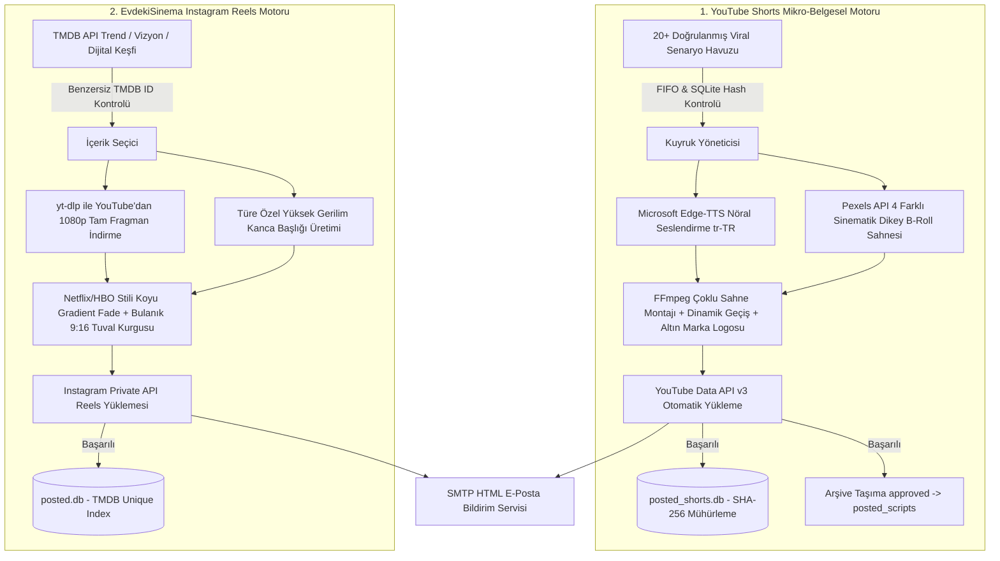

# 🚀 Auto Viral Media Engine (Otonom Sosyal Medya Fabrikası)

<p align="center">
  
  
  
  
  
  
</p>

---

## ⚡ TEK KOMUTLA ETKİLEŞİMLİ KURULUM (Ubuntu 22.04 / 24.04 & Debian)

Temiz bir Ubuntu sunucusu açtıktan sonra aşağıdaki **tek komutu** çalıştırmanız yeterlidir. Kurulum sihirbazı tüm sistem bağımlılıklarını (`FFmpeg`, `Python3`, `Venv`, `Fonts`) otomatik kurar, size API ve hesap bilgilerinizi tek tek sorarak `.env` dosyanızı oluşturur ve 7/24 otonom çalışma için `crontab` zamanlayıcınızı ayarlar:

```bash
curl -sSL https://raw.githubusercontent.com/beratcemzengin/auto-viral-media-engine/main/install.sh | bash
```

*(Veya `wget` ile: `wget -qO- https://raw.githubusercontent.com/beratcemzengin/auto-viral-media-engine/main/install.sh | bash`)*

---

## 📌 Proje Nedir? (Projenin Amacı ve Felsefesi)

**Auto Viral Media Engine**, hiçbir insan müdahalesine ihtiyaç duymadan 7/24 otonom olarak çalışan, **YouTube Shorts** ve **Instagram Reels** algoritmalarını domine etmek üzere tasarlanmış yeni nesil bir yapay zeka & medya üretim motorudur.

Geleneksel sosyal medya botları sadece önceden kaydedilmiş videoları yüklerken, bu sistem **içeriği sıfırdan keşfeder, metni kurgular, nöral ses üretir, konuya özel sinematik B-Roll sahnelerini indirir, profesyonel FFmpeg montajını tamamlar ve yükleyip veritabanına mühürler.**

---

## 🧠 İki Ayrı Bağımsız Üretim Hattı



---

## 🖥️ Hangi Sunucu / Donanım Gerekiyor?

Sistem tamamen optimize edilmiş, düşük CPU tüketimli ve bellek sızıntısı yapmayan asenkron mimariye sahiptir. Evinizdeki eski bir mini bilgisayarda veya en ucuz bulut sunucusunda (VPS) sorunsuz çalışır.

### 📊 Donanım Gereksinim Tablosu

| Bileşen | Minimum Gereksinim | Önerilen Sunucu | Açıklama |
| :--- | :--- | :--- | :--- |
| **İşlemci (CPU)** | 2 Çekirdek (x86_64 veya ARM64) | 4 Çekirdek (Intel/AMD/ARM) | FFmpeg video render ve blur filtreleri için |
| **Bellek (RAM)** | 2 GB RAM | 4 GB RAM | 1080x1920 video kurgusu sırasında ~1.2 GB RAM kullanılır |
| **Disk Alanı** | 15 GB SSD / NVMe | 40 GB NVMe SSD | Geçici video klipleri indirilir ve işlem bitince otomatik silinir |
| **İnternet Hızı** | 10 Mbps Download / Upload | 50+ Mbps | Fragman ve B-Roll indirme/yükleme hızı için |
| **İşletim Sistemi** | Ubuntu 22.04/24.04 LTS, Debian 11/12 | Ubuntu 24.04 LTS (Server) | Windows 10/11 Pro da tam desteklenir |

> [!TIP]
> **Önerilen Ucuz Sunucu Sağlayıcıları:** Hetzner Cloud (CX22 / CPX21), DigitalOcean ($6-12 Droplet), Contabo VPS, AWS EC2 (t3.medium), veya evde 7/24 açık duran **CasaOS / Raspberry Pi 4-5 (8GB)** mini PC.

---

## 🔑 Gerekli API Anahtarları ve Hazırlık

Kurulum sihirbazı çalıştığında sizden şu 5 bilgiyi isteyecektir:

1. **Pexels API Key:** [pexels.com/api](https://www.pexels.com/api/) (Ücretsiz dikey B-Roll video indirmeleri için).
2. **TMDB API Key:** [themoviedb.org/settings/api](https://www.themoviedb.org/settings/api) (Ücretsiz film/dizi keşfi için).
3. **YouTube Data API v3:** Google Cloud Console üzerinden OAuth `client_secrets.json` dosyası.
4. **Instagram Kullanıcı Adı ve Şifresi:** Reels paylaşımları için.
5. **SMTP Mail Bilgileri:** Yandex veya Gmail üzerinden anlık e-posta başarı/hata bildirimleri için.

---

## ⏰ 7/24 Otonom Yayın Takvimi (Crontab)

Otomatik kurulum sihirbazını çalıştırdığınızda aşağıdaki yayın takvimi sunucunuzun `crontab` tablosuna otomatik olarak eklenir:

| Saat (TR) | Platform | Otomasyon Modülü | İçerik Özelliği |
| :---: | :---: | :--- | :--- |
| 🌅 **07:30** | **YouTube Shorts** | `shorts_automation` | 🧠 4 Sahneli Viral Mikro-Belgesel |
| 🌅 **09:00** | **Instagram Reels** | `evdekisinema_reels` | 🍿 Sinematik Tam Fragman Reels |
| ☀️ **11:00** | **YouTube Shorts** | `shorts_automation` | 🧠 4 Sahneli Viral Mikro-Belgesel |
| 🌙 **17:00** | **Instagram Reels** | `evdekisinema_reels` | 🍿 Sinematik Tam Fragman Reels |
| 🌙 **17:30** | **YouTube Shorts** | `shorts_automation` | 🧠 4 Sahneli Viral Mikro-Belgesel |
| 🌙 **20:00** | **YouTube Shorts** | `shorts_automation` | 🧠 4 Sahneli Viral Mikro-Belgesel |
| 🗓️ **Pazar 03:00** | **Sistem Yedeği** | `server_backup_mailer` | 💾 Haftalık Canlı ZIP Eki E-Postası |

---

## 🛡️ Sık Sorulan Sorular ve Hata Çözümleri (FAQ)

<details>
<summary><b>1. YouTube API "Quota Exceeded" Hatası Veriyor, Ne Yapmalıyım?</b></summary>
Google Cloud, YouTube Data API v3 için günlük ücretsiz 10.000 kota birimi verir. Bir video yükleme işlemi 1.600 birim harcar. Yani günde ücretsiz olarak en fazla 6 video yükleyebilirsiniz. Günde 4 Shorts paylaşımı kota sınırlarının tamamen içindedir.
</details>

<details>
<summary><b>2. FFmpeg Video İşlerken Donuyor veya Çok Yavaş Kalıyor?</b></summary>
Video işleme modülü (`video_processor.py`), arka plan bulanıklaştırma (boxblur) filtresini 1080p yerine önce 270x480 çözünürlüğe düşürüp blur uyguladıktan sonra 1080p'ye büyütür. Bu sayede CPU yükü %90 oranında azalır ve 1-2 çekirdekli sunucularda bile render 30-45 saniyede tamamlanır.
</details>

<details>
<summary><b>3. Aynı Video İki Kez Paylaşılabilir mi?</b></summary>
Hayır. Hem YouTube hem Instagram motorlarında çift katmanlı SQLite veritabanı mühürlemesi (SHA-256 metin hash'i ve benzersiz TMDB ID) ile atomic dosya taşıma sistemi aktiftir. Daha önce paylaşılan hiçbir içerik tekrar işlenmez.
</details>

---

## 📜 Lisans & Geliştirici

Bu proje **MIT Lisansı** altında korunmaktadır. Ticari ve kişisel projelerinizde dilediğiniz gibi kullanabilir, özelleştirebilirsiniz.

* **Geliştirici:** [Berat Cem Zengin](https://github.com/beratcemzengin)
* **Destek & İletişim:** `beratcemzengin@gmail.com`

⭐ Projeyi beğendiyseniz GitHub üzerinden bir **Star** bırakmayı unutmayın! 🚀🍿
