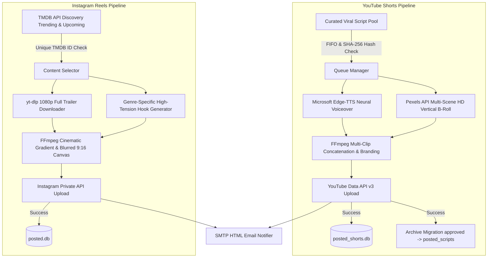

# 🚀 Auto Viral Media Engine (Autonomous Social Media Pipeline)

<p align="center">
  
  
  
  
  
  
</p>

An enterprise-grade, 24/7 autonomous AI content generation and publishing engine designed to create, render, and publish high-retention **YouTube Shorts** (micro-documentaries) and **Instagram Reels** (cinematic full trailers) with persistent anti-duplicate memory and real-time email alerting.

---

## ⚡ 1-Click Interactive Installation (Ubuntu 22.04 / 24.04 LTS & Debian)

Run the following command on a fresh Ubuntu or Debian server. The interactive setup wizard will automatically install system packages (`FFmpeg`, `Python3`, `Venv`, `Fonts`), guide you through your API credentials, generate your `.env` configuration, initialize SQLite databases, and configure your 24/7 crontab schedule:

```bash
curl -sSL https://raw.githubusercontent.com/beratcemzengin/auto-viral-media-engine/main/install.sh | bash
```

*(Or via `wget`: `wget -qO- https://raw.githubusercontent.com/beratcemzengin/auto-viral-media-engine/main/install.sh | bash`)*

---

## 🔑 Prerequisites & Detailed API Setup Guide

Follow the step-by-step instructions below to obtain the required API credentials (all services offer generous free tiers):

### 1. 🎥 Pexels API Key (Free HD Vertical B-Roll)
*Pexels API is used by the YouTube Shorts engine to download dynamic, relevant 4-scene vertical HD B-Roll clips.*
1. Go to [Pexels API Portal](https://www.pexels.com/api/) and sign up for a free account.
2. Click **"Your API Key"** in the top navigation bar.
3. Describe your application (e.g., *Automated social media content generator*) and accept the API terms.
4. Copy the generated **API Key** (a 56-character string).
5. Add it to your `.env` file:
   ```ini
   PEXELS_API_KEY=your_pexels_api_key_here
   ```

---

### 2. 🎬 TMDB API Key (Free Movie & TV Discovery)
*TheMovieDatabase (TMDB) API is used by the Instagram Reels engine to discover trending movies, series, and upcoming box-office releases.*
1. Create a free account at [themoviedb.org](https://www.themoviedb.org/signup).
2. Verify your email address and log in.
3. Navigate to **Account Settings > API** ([themoviedb.org/settings/api](https://www.themoviedb.org/settings/api)).
4. Click **"Create"** and select **"Developer"**.
5. Accept the terms of service and fill in the required application details:
   * **Application Name:** `Auto Viral Media Engine`
   * **Application URL:** `https://github.com/beratcemzengin/auto-viral-media-engine`
   * **Summary:** `Automated media discovery and trailer curation engine.`
6. Copy the **API Key (v3 auth)**.
7. Add it to your `.env` file:
   ```ini
   TMDB_API_KEY=your_tmdb_v3_api_key_here
   ```

---

### 3. 🔴 Google Cloud YouTube Data API v3 (YouTube Uploads)
*Google OAuth 2.0 credentials are required to automatically publish rendered Shorts to your YouTube channel.*
1. Open the [Google Cloud Console](https://console.cloud.google.com/).
2. Create a new project (e.g., `YouTube-Shorts-Automation`).
3. In the sidebar, go to **APIs & Services > Library**, search for **YouTube Data API v3**, and click **Enable**.
4. Go to **APIs & Services > OAuth consent screen**:
   * Select User Type: **External** and click **Create**.
   * Fill in **App Name** (`Shorts Uploader`) and **User Support Email**.
   * Under **Test users**, click **+ ADD USERS** and enter the Gmail address associated with your YouTube channel.
   * Save and continue.
5. Go to **APIs & Services > Credentials**:
   * Click **+ CREATE CREDENTIALS > OAuth client ID**.
   * Application type: **Desktop app**.
   * Name: `Shorts-Desktop-Client`.
6. Click **Download JSON** on the created OAuth client.
7. Rename the downloaded file to **`client_secrets.json`** and place it inside the `shorts_automation/` folder.
8. **Initial Authorization:** Run the pipeline once (`python -m shorts_automation.main`). A Google authorization link will appear. Open the link, sign in with your channel's Google account, and grant upload permissions. A persistent **`credentials.json`** token will be generated automatically for 24/7 headless server uploads.

---

### 4. 📸 Instagram Account & Session Setup (Instagram Reels)
*The Instagram engine uses private mobile API emulation (`instagrapi`) to upload 1080x1920 90s Reels with full custom metadata.*
1. In your `.env` file, specify your account credentials:
   ```ini
   INSTAGRAM_USERNAME=your_instagram_username
   INSTAGRAM_PASSWORD=your_instagram_password
   ```
2. **Session Persistence:** On the first successful login, the engine exports an authenticated device session to `instagram_reels/session.json`. Subsequent runs reuse this session cookie without triggering login checkpoints or 2FA challenges.

---

### 5. 📧 SMTP Email Notifications (Instant Alerts & Weekly Backups)
*Get instant HTML email notifications when videos are published (or if an error occurs), plus automated weekly full system ZIP backups.*

#### Option A: Yandex Mail (Recommended)
1. Go to [Yandex ID Security](https://id.yandex.com/security/app-passwords).
2. Click **App passwords > Create app password > Mail**.
3. Copy the 16-character generated password and configure `.env`:
   ```ini
   ALERT_EMAIL_RECIPIENT=your_notification_email@gmail.com
   SMTP_SERVER=smtp.yandex.com
   SMTP_PORT=587
   SMTP_USER=alert@yourdomain.com
   SMTP_PASSWORD=your_yandex_app_password
   SMTP_USE_TLS=true
   ```

#### Option B: Gmail (Google Workspace / Personal)
1. Enable **2-Step Verification** on your Google Account.
2. Visit [Google App Passwords](https://myaccount.google.com/apppasswords).
3. Generate a new app password for **"Mail"**.
4. Configure `.env`:
   ```ini
   ALERT_EMAIL_RECIPIENT=your_notification_email@gmail.com
   SMTP_SERVER=smtp.gmail.com
   SMTP_PORT=587
   SMTP_USER=your_email@gmail.com
   SMTP_PASSWORD=your_16_digit_gmail_app_password
   SMTP_USE_TLS=true
   ```

---

## 🌟 Key Architecture & Capabilities

### 1. 🧠 YouTube Shorts Viral Engine (`shorts_automation`)
* **Cognitive-Gap Script Engine:** Curated pool of 20+ verified, fact-checked viral micro-documentary scripts (Business Wars, Sports Legends, Science Mysteries, Historical Curiosities).
* **Dynamic Multi-Scene B-Roll (4-Scene Transition):** Automatically queries Pexels API to download contextual HD vertical clips and cuts every 4–6 seconds to maximize audience retention.
* **Neural Edge TTS & 2-Line Kinetic Subtitles:** Generates human-like voiceovers (`edge-tts`) with synchronized animated captions.
* **Smart Audio & Logo Mixing:** Background music ducking, gold brand tag overlays, and seamless loop ending hooks.
* **Dual-Layer Anti-Duplicate Engine:** SHA-256 text hashing stored in SQLite (`posted_shorts.db`) and automatic FIFO file migration (`approved_scripts/` ➔ `posted_scripts/`). Zero duplicate uploads guaranteed.

### 2. 🍿 Instagram Reels Cinematic Engine (`instagram_reels`)
* **Automated Discovery:** Fetches trending movies, upcoming releases, and digital platform series via the TMDB API.
* **Full Trailer Processing (Up to 90s):** Eliminates silent studio intros and preserves the entire action/dialogue trailer.
* **Netflix & HBO Style Aesthetic:** Vertical dark gradient fade, blurred darkened background canvas (CPU-optimized downscale-blur-upscale pipeline), and floating badge boxes (IMDb Score, Genre, Platform, DM Share CTA).
* **Persistent Deduplication:** SQLite database (`posted.db`) with unique TMDB ID indexing prevents repeated posts.

---

## 🏗️ System Flowchart



---

## 🖥️ Hardware & Server Requirements

| Component | Minimum Specification | Recommended Specification | Note |
| :--- | :--- | :--- | :--- |
| **Processor (CPU)** | 2 Cores (x86_64 or ARM64) | 4 Cores (Intel / AMD / ARM) | For FFmpeg encoding & blur rendering |
| **Memory (RAM)** | 2 GB RAM | 4 GB RAM | Uses ~1.2 GB during 1080p rendering |
| **Storage (Disk)** | 15 GB SSD / NVMe | 40 GB NVMe SSD | Temporary video files are cleaned automatically |
| **Network** | 10 Mbps Download / Upload | 50+ Mbps | For fast video download & upload |
| **Operating System** | Ubuntu 22.04 / 24.04 LTS, Debian 11/12 | Ubuntu 24.04 LTS (Server) | Windows 10/11 Pro also supported |

---

## ⏰ Automated Crontab Schedule

Add the following schedule to `crontab -e`:

```bash
# ==============================================================================
# AUTO VIRAL MEDIA ENGINE CRONTAB SCHEDULE (UTC+3 / TR Time)
# ==============================================================================

# 🍿 Instagram Reels (Daily at 09:00 & 17:00 TR Time / 06:00 & 14:00 UTC)
0 6 * * * /opt/auto-viral-media-engine/venv/bin/python3 /opt/auto-viral-media-engine/instagram_reels/main.py >> /opt/auto-viral-media-engine/instagram_reels/logs/reels.log 2>&1
0 14 * * * /opt/auto-viral-media-engine/venv/bin/python3 /opt/auto-viral-media-engine/instagram_reels/main.py >> /opt/auto-viral-media-engine/instagram_reels/logs/reels.log 2>&1

# 🧠 YouTube Shorts (4 Times Daily: 07:30, 11:00, 17:30, 20:00 TR Time)
30 4 * * * /opt/auto-viral-media-engine/venv/bin/python3 /opt/auto-viral-media-engine/shorts_automation/main.py >> /opt/auto-viral-media-engine/shorts_automation/logs/shorts.log 2>&1
0 8 * * * /opt/auto-viral-media-engine/venv/bin/python3 /opt/auto-viral-media-engine/shorts_automation/main.py >> /opt/auto-viral-media-engine/shorts_automation/logs/shorts.log 2>&1
30 14 * * * /opt/auto-viral-media-engine/venv/bin/python3 /opt/auto-viral-media-engine/shorts_automation/main.py >> /opt/auto-viral-media-engine/shorts_automation/logs/shorts.log 2>&1
0 17 * * * /opt/auto-viral-media-engine/venv/bin/python3 /opt/auto-viral-media-engine/shorts_automation/main.py >> /opt/auto-viral-media-engine/shorts_automation/logs/shorts.log 2>&1

# 💾 Weekly System & Database Backup Email (Every Sunday at 03:00 TR Time)
0 0 * * 0 /opt/auto-viral-media-engine/venv/bin/python3 /opt/auto-viral-media-engine/shorts_automation/server_backup_mailer.py >> /opt/auto-viral-media-engine/shorts_automation/logs/backup.log 2>&1
```

---

## 🛡️ Frequently Asked Questions (FAQ)

<details>
<summary><b>1. How do YouTube API quotas work?</b></summary>
Google Cloud provides 10,000 free quota units per day for YouTube Data API v3. A standard video upload costs 1,600 units. Thus, you can upload up to 6 videos per day completely free of charge. Scheduling 4 Shorts per day is well within the free limits.
</details>

<details>
<summary><b>2. How is rendering speed optimized on low-spec CPUs?</b></summary>
The video processing pipeline scales the background video down to 270x480 before applying the boxblur filter, then scales it back up to 1080x1920. This reduces blur computation by ~90%, enabling full 90s 1080p renders in under 30 seconds on 2-core VPS nodes.
</details>

<details>
<summary><b>3. Is duplicate posting prevented?</b></summary>
Yes. Both pipelines use SQLite database indexing (SHA-256 script hashing and unique TMDB IDs) along with atomic file migration (`approved_scripts/` to `posted_scripts/`). No content is ever processed or published twice.
</details>

---

## 📄 License & Author

Distributed under the **MIT License**. See `LICENSE` for more information.

* **Author:** [Berat Cem Zengin](https://github.com/beratcemzengin)
* **Contact:** `beratcemzengin@gmail.com`

⭐ If you find this project useful, please consider giving it a **Star** on GitHub! 🚀🍿
